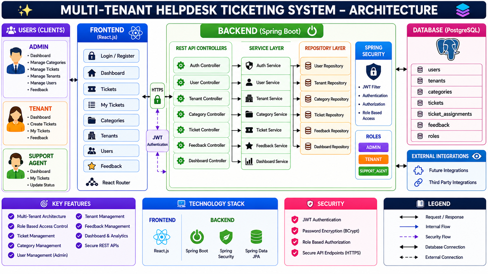

# 🎫 Multi-Tenant Helpdesk Ticketing System

A Full-Stack Helpdesk Ticketing System built using Spring Boot, React, PostgreSQL and JWT Authentication with Role-Based Access Control (RBAC).


---

# 🏗 System Architecture

<p align="center">
  
</p>

---

# 📌 Project Overview

The Multi-Tenant Helpdesk Ticketing System is a full-stack enterprise-style support management platform designed to streamline ticket handling, user management, and issue resolution workflows.

The application allows tenants to raise support requests, support agents to work on assigned tickets, and administrators to manage users, categories, tenants, and ticket assignments.

The system follows a layered architecture using Spring Boot, Spring Security, JWT Authentication, PostgreSQL, and React.

---

# 🎯 Key Highlights

- Multi-Tenant Architecture
- JWT Authentication
- Role-Based Access Control (RBAC)
- Spring Security Integration
- PostgreSQL Database
- RESTful APIs
- React Frontend
- Full CRUD Operations
- Ticket Assignment Workflow
- Feedback Management System

---

# 🚀 Tech Stack

## Backend

- Java 21
- Spring Boot
- Spring Security
- Spring Data JPA
- Hibernate
- JWT Authentication
- Maven

## Frontend

- React
- React Router
- Axios
- CSS

## Database

- PostgreSQL

## Tools

- Git
- GitHub
- Postman
- VS Code
- Spring Tool Suite (STS)

---

# ✨ Features

## Authentication & Authorization

- User Registration
- User Login
- JWT Authentication
- Role-Based Access Control
- Protected Routes

## Ticket Management

- Create Ticket
- Assign Ticket
- Update Ticket Status
- View Assigned Tickets
- View My Tickets
- Track Ticket Progress

## Category Management

- Create Categories
- View Categories

## Tenant Management

- Create Tenant
- View Tenant Details

## User Management

- Create Admin Users
- Create Support Agents
- Manage Roles

## Feedback Management

- Submit Feedback
- View Feedback
- Ticket-Based Feedback Tracking

---

# 👥 Roles & Permissions

## 👑 Admin

### Access

- Manage Users
- Manage Categories
- Manage Tenants
- View All Tickets
- Assign Tickets
- Update Ticket Status
- View Feedback

---

## 🏢 Tenant

### Access

- Create Tickets
- View Own Tickets
- Track Ticket Status
- Submit Feedback

---

## 🛠 Support Agent

### Access

- View Assigned Tickets
- Resolve Tickets
- Close Tickets
- Update Ticket Status

---

# 🔗 API Overview

## Authentication APIs

```http
POST /api/auth/register
POST /api/auth/login
```

## Category APIs

```http
GET /api/categories
POST /api/categories
```

## Ticket APIs

```http
GET /api/tickets
POST /api/tickets
PUT /api/tickets/{id}/assign/{userId}
PUT /api/tickets/{id}/status
GET /api/tickets/my
```

## Tenant APIs

```http
GET /api/tenants
POST /api/tenants
```

## Feedback APIs

```http
GET /api/feedback
POST /api/feedback
```

## User APIs

```http
GET /api/users
POST /api/users
```

---

# 📂 Project Structure

```text
helpdesk-ticketing-system
│
├── helpdesk
│   ├── src/main/java
│   │   ├── auth
│   │   ├── category
│   │   ├── dashboard
│   │   ├── feedback
│   │   ├── security
│   │   ├── tenant
│   │   ├── ticket
│   │   ├── user
│   │   └── common
│   │
│   ├── src/main/resources
│   └── pom.xml
│
├── helpdesk-ui
│   ├── src
│   │   ├── api
│   │   ├── components
│   │   ├── pages
│   │   ├── routes
│   │   └── services
│   │
│   └── package.json
│
├── images
│   └── architecture-diagram.png
│
└── README.md
```

---

# 🔒 Security Features

- JWT Authentication
- BCrypt Password Encryption
- Stateless Session Management
- Role-Based Authorization
- Spring Security Integration
- Protected React Routes

---

# ⚙️ How to Run the Project

## Prerequisites

Install the following:

- Java 21+
- Maven
- Node.js
- PostgreSQL
- Git

---

## Clone Repository

```bash
git clone https://github.com/Nikil1717/helpdesk-ticketing-system.git

cd helpdesk-ticketing-system
```

---

## Database Setup

Create PostgreSQL database:

```sql
CREATE DATABASE helpdesk;
```

Update:

```properties
helpdesk/src/main/resources/application.properties
```

Example:

```properties
spring.datasource.url=jdbc:postgresql://localhost:5432/helpdesk
spring.datasource.username=postgres
spring.datasource.password=your_password

spring.jpa.hibernate.ddl-auto=update
```

---

## Run Backend

```bash
cd helpdesk

mvn spring-boot:run
```

Backend URL:

```text
http://localhost:8080
```

---

## Run Frontend

```bash
cd helpdesk-ui

npm install

npm run dev
```

Frontend URL:

```text
http://localhost:5173
```

---

# 🔄 Application Workflow

### Tenant

- Register/Login
- Create Ticket
- Track Ticket Status
- Submit Feedback

### Admin

- Create Categories
- Create Support Agents
- Create Admin Users
- Manage Tenants
- Assign Tickets

### Support Agent

- View Assigned Tickets
- Resolve Tickets
- Close Tickets
- Update Ticket Status

---

# 📈 Learning Outcomes

This project helped strengthen understanding of:

- Spring Boot Architecture
- REST API Development
- JWT Authentication
- Spring Security
- React Frontend Development
- PostgreSQL Integration
- JPA & Hibernate
- Role-Based Access Control
- Full-Stack Application Development
- Git & GitHub Workflow

---

# 🔮 Future Enhancements

- Database Schema Diagram
- Dashboard Analytics
- Advanced Search & Filters
- SLA Management
- Escalation Engine
- Audit Logs
- Docker Support
- AWS Deployment
- Redis Caching
- Ticket Attachments
- Real-Time Notifications

---

# 👨‍💻 Author

## Nikil T M

Backend Developer | Java | Spring Boot | React | PostgreSQL

GitHub: https://github.com/Nikil1717

---

⭐ If you found this project useful, consider giving it a star.